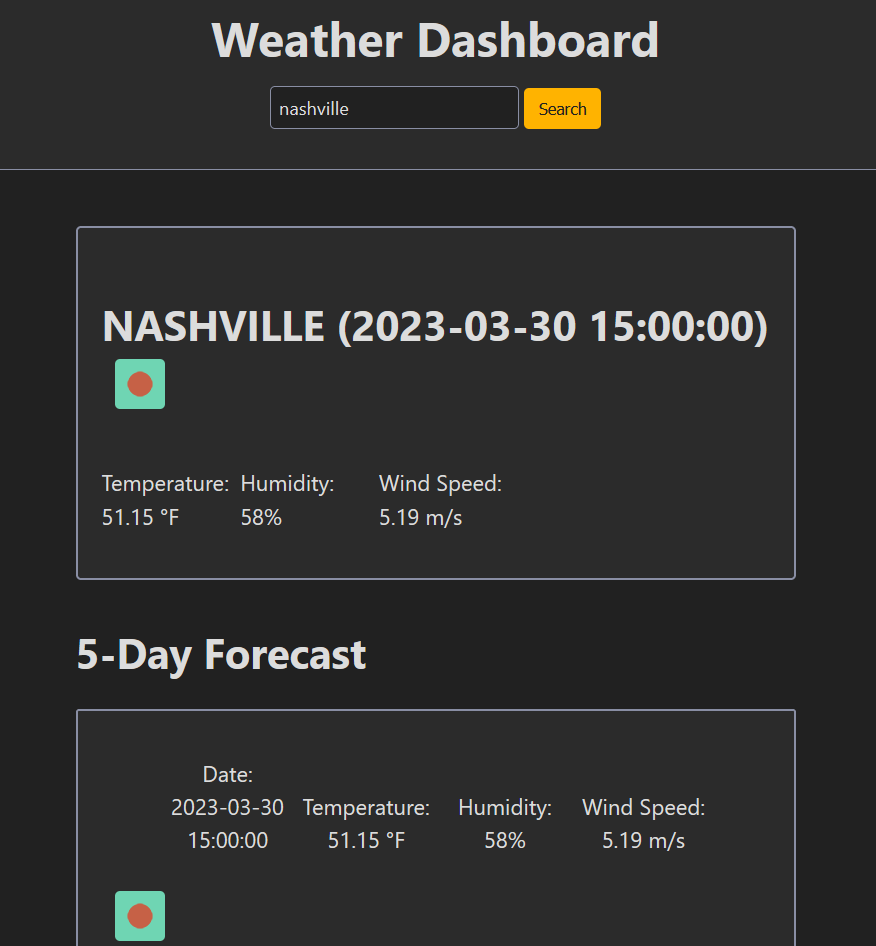

# Weather Dashboard

The Weather Dashboard is a web application that allows users to search for current weather conditions and a 5-day forecast for any city in the world. It was built using HTML, CSS, and JavaScript, and utilizes the OpenWeather API to retrieve weather data.

## Features

* Search for weather data for any city in the world
* View current temperature, humidity, wind speed, and UV index
* View a 5-day forecast for the selected city
* See the city's weather conditions displayed on a map

## Usage

To use the Weather Dashboard, simply open the web application with this link: [Weather Dashboard Website](https://lohmarr.github.io/06-Weather-Dash-Rotary/)

Type in the name of the city you want to search for in the search bar. Once you hit the search button, the application will display the city's current weather conditions and a 5-day forecast.

You can also click on any of the search history buttons to quickly search for a previously searched city.

## Installation

To install the Weather Dashboard, simply download the source code from the GitHub repository and open the index.html file in your browser.

## Credits

The Weather Dashboard was built by Lohmar using the OpenWeather API. Special thanks to OpenWeather for providing the weather data used in this application.

## License

The Weather Dashboard is licensed under the MIT License. Feel free to use and modify the code as you see fit.
